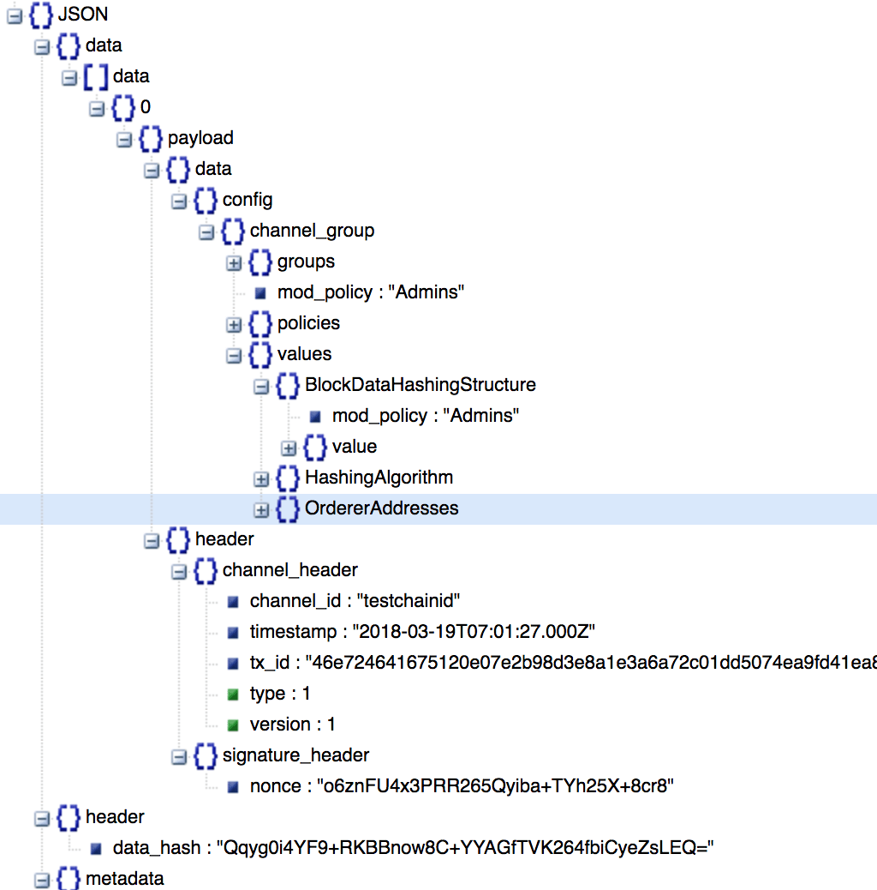
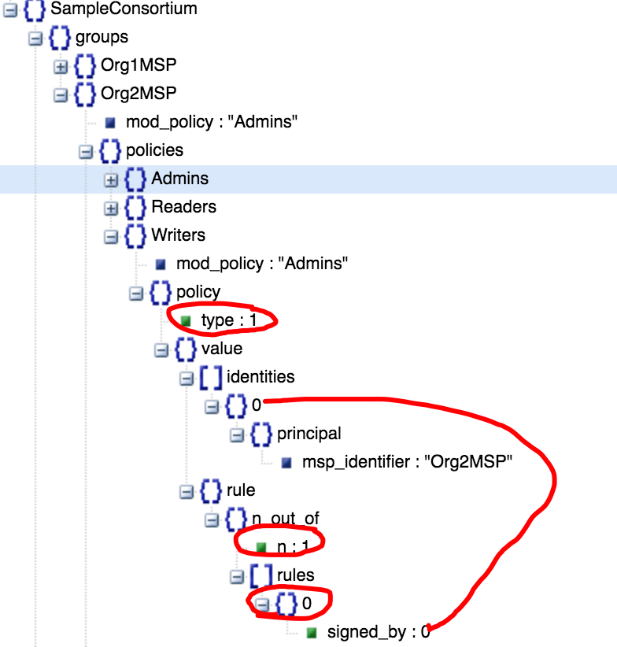

## 创世区块

它是区块链网络的第一个block,  Channel的第一个block是peer create channel时才创建的.

### 工具configtxgen

生成创世区块的的命令是:
```shell
configtxgen -profile TwoOrgsOrdererGenesis -outputBlock ./channel-artifacts/genesis.block
```
命令输出:
```
/Users/haibbo/code/fabric-samples/first-network/../bin/configtxgen
##########################################################
#########  Generating Orderer Genesis block ##############
##########################################################
2018-03-19 15:34:18.170 CST [common/configtx/tool] main -> INFO 001 Loading configuration
2018-03-19 15:34:18.233 CST [common/configtx/tool] doOutputBlock -> INFO 002 Generating genesis block
2018-03-19 15:34:18.236 CST [common/configtx/tool] doOutputBlock -> INFO 003 Writing genesis block
```

在未指定读取的配置文件路径, configtxgen会搜索本地路径下的configtx.yaml, 生成创世区块使用了Profile TwoOrgsOrdererGenesis.

### 创世区块内容

如下命令可以dump出创世区块的内容, 除了配置文件指定的这些值外, 还有很多其他的值.
```shell
configtxgen -profile TwoOrgsOrdererGenesis -inspectBlock channel-artifacts/genesis.block
```
或通过configtxlator
```shell
configtxlator start --hostname="0.0.0.0" --port 7059

curl -X POST --data-binary @channel-artifacts/genesis.block  \ http://127.0.0.1:7059/protolator/decode/common.Block
```
结构如下:

整个区块包含三个子树, , Value, Policies 和 Group, Group可以嵌套更多的树, Value和Policies记录具体的数值.
所有的叶子节点都包括三个元素：   

- Value/Policy：记录所配置的内容数据结构
- ModPolicy：对该内容修改策略, 指定谁有权限修改.

#### Value子树

上图的value子树, 记录了Hash算法、Orderer地址, 数据块Hash结构(默克尔树的width).

#### Policies子树

Poclicy子树记录了包括Readers、Writers、Admins三部分，分别规定了对链的读、写和管理者角色所指定的权限策略. 策略中规定了如何对签名来进行验证，以证明权限。

每个角色都包括ModPolicy(指定对当前策略进行修改的身份). 以及Policy(规定该角色需要满足的策略).

1：表示SIGNATURE，必须要匹配指定签名的组合；   
2：表示MSP，某MSP下的身份即可(未实现)
3：表示IMPLICIT_META，表示隐式的规则，该类规则需要对通道中所有的子组检查策略，并通过rule来指定具体的规则，包括ANY、ALL、MAJORITY三种：   
- ANY：满足任意子组的读角色；   
- ALL：满足所有子组的读角色；   
- MAJORITY：满足大多数子组的读角色.

#### Groups.Consortiums子树

包含一个链码SampleConsortium, 由Org1和Org2两个组织构成.

Group->Consortiums->SampleConsortium结构如下:


- 每个组织下有policies 和value
- Value里面是admin, root 的证书(CA 证书), 可以拿来校验请求者的身份.
>- 是不是这个组织里面的
>- 是不是这个组织里的管理员


- type 1: SIGNATURE，必须要匹配指定签名的组合； 

- n_out_of 是满足下面rules的几条才匹配, 当前只有一条规则

- 第一个 rule是sign by 0, 这个0代表的是identities下的第一个principal, 此时它的要求是msp id 是Org2MSP, 

  ​

Principal 类型有三种:
- 0：表示基于实体的角色来进行判断，此时Principal值可以为Admin或Member，表示MSP中的管理员或成员角色；   
- 1：表示基于实体所属的ORGANIZATION_UNIT进行判断，此时Principal值可以为指定的组织单元
- 2：表示基于实体的身份来进行判断，此时Principal值可以为指定的实体。


#### Groups.Orderer

Values中记录的大多数都是配置文件中的数据:

- BatchSize
- BatchTImeout
- ConsensusType

Polocies包含了Admins, Readers, Writes四种角色的权限

Groups.OrdererOrg主要记录了orderer组织的MSP信息.
