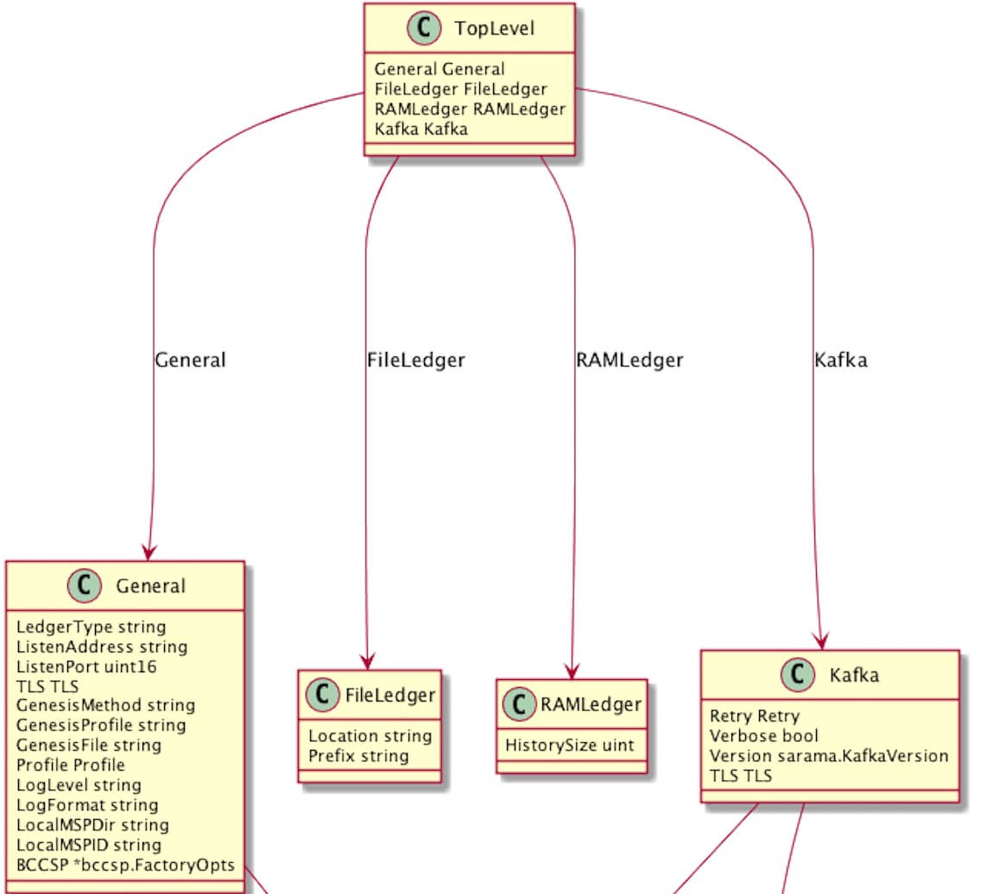

## Orderer  启动之参数传递


### 参数传递
Orderer启动时会读取配置文件orderer.yaml和环境变量里的值. 环境变量里的优先级较高, 这样方便我们通过docker compose里的environment来定制orderer的行为.

每个环境变量的名称都有一个前缀，各个模块都是单独设置的，比如 ORDERER_GENERAL_GENESISMETHOD 的前缀是ORDERER,读取的配置文件是orderer.yaml。Peer节点的变量名称前缀是CORE,读取的配置文件是core.yaml。环境变量名称是以“_”作为分隔符的，代表一种层级，是和配置文件一一对应的，比如ORDERER_GENERAL_GENESISMETHOD对应orderer.yaml配置文件的General.GenesisMethod。在代码中,对应的是 General结构体下的GenesisMethod变量.

环境变量和配置文件的变量名称都是不区分大小写的，内部会统一转换处理。

### 参数传递的实现
主要使用了viper 和 mamapstructure 完成配置方案. Orderer在它的main函数中调用 config.Load(), config.Load代码如下:
```
	config := viper.New()
	## 这里的configName 是ToLower(Prefix), 且Prefix = "ORDERER"
	cf.InitViper(config, configName) 
	
	// for environment variables
	## 设置环境变量的前缀
	config.SetEnvPrefix(Prefix)
	## 设置钩子 读取环境变量
	config.AutomaticEnv()
	## 设置replacer,把环境变量里的 _ 替换成 .
	replacer := strings.NewReplacer(".", "_")
	config.SetEnvKeyReplacer(replacer)
	##  读取配置文件,viper支持很多类型的配置文件, 这里只提供了configName, 它会依次查找,configName.json, configName.toml configName.yaml等,先找到那个使用那个.
	err := config.ReadInConfig()
	if err != nil {
		logger.Panic("Error reading configuration:", err)
	}

	var uconf TopLevel
	## 返序列化到结构体TopLevel
	err = viperutil.EnhancedExactUnmarshal(config, &uconf)
	if err != nil {
		logger.Panic("Error unmarshaling config into struct:", err)
	}
	## 在遗漏的配置上 设定默认值, 在config.go里同时定义了defaults TopLevel,里面设定了初始值.
	uconf.completeInitialization(filepath.Dir(config.ConfigFileUsed()))

	return &uconf
```
EnhancedExactUnmarshal的实现大概如下:
```
	baseKeys := v.AllSettings()
	getterWithClass := func(key string) interface{} { return v.Get(key) } // hide receiver
	leafKeys := getKeysRecursively("", getterWithClass, baseKeys)
	## LeafKeys是一个嵌套的map, 类似于 map[general:map[ListenPort:7050 LocalMSPDir:msp GenesisFile:genesisblock] ........]
	
	## 设置钩子, 可以用来对一些值做合法性检查. 
	## 例如,这样启动orderer会报错. ORDERER_KAFKA_VERSION="1.0" ./orderer start
	## 报错 Unsupported Kafka version: '1.0',把ORDERER_KAFKA_VERSION改成0.8.2 就可以了
	config := &mapstructure.DecoderConfig{
.........
		DecodeHook: mapstructure.ComposeDecodeHookFunc(
			customDecodeHook(),
			byteSizeDecodeHook(),
			stringFromFileDecodeHook(),
			pemBlocksFromFileDecodeHook(),
			kafkaVersionDecodeHook(),
		),
	}
	## 使用用mapstructure 创建docder, 进行最后的反序列化
	decoder, err := mapstructure.NewDecoder(config)
	if err != nil {
		return err
	}
	return decoder.Decode(leafKeys)
```
### 配置文件和对应的数据结构

下面提取Struct的定义和orderer.yaml的配置, 就很容易看到他们的关系, 简单说, 就是把orderer.yaml里面的配置映射到struct它里面, 在处理时, 加入了更高优先级环境变量的处理.


```~/c/fabric❯❯❯ cat /orderer.yaml | grep -v "^ *#" | grep -v "^$"                                         
General:
    LedgerType: file
    ListenAddress: 127.0.0.1
    ListenPort: 7050
   ………………………………………….
    LocalMSPDir: msp
    LocalMSPID: DEFAULT
FileLedger:
    Location: /var/hyperledger/production/orderer
    Prefix: hyperledger-fabric-ordererledger
RAMLedger:
    HistorySize: 1000
Kafka:
    Retry:
        ShortInterval: 5s
        ShortTotal: 10m
       ……………………………
```