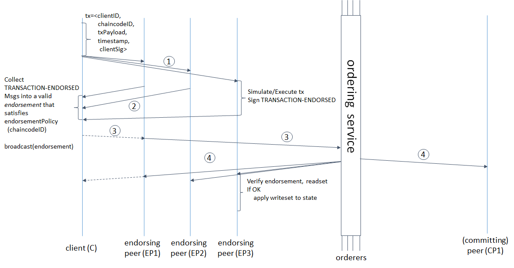
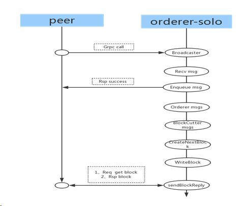

## 交易流程 - 排序节点

###  流程
1, 通过Broadcast服务接受客户端发送过来的已经背书过的交易, 验证合法性

2, 根据交易数量或时间触发, 将排好序的交易打包, 创建Block

3, 通过Deliver给发送给提交节点(Leader)




### Broadcast服务端Broadcast处理流程

Broadcast服务端Broadcast处理流程，即broadcast.handlerImpl.Handle方法。

**接收Envelope消息，并获取Payload和ChannelHeader**

```go
msg, err := srv.Recv() //接收Envelope消息
payload, err := utils.UnmarshalPayload(msg.Payload) //反序列化获取Payload
chdr, err := utils.UnmarshalChannelHeader(payload.Header.ChannelHeader) //反序列化获取ChannelHeader
//代码在orderer/common/broadcast/broadcast.go
```

**如果消息类型为channel配置或更新，则使用multichain.Manager处理消息**

```go
if chdr.Type == int32(cb.HeaderType_CONFIG_UPDATE) { //如果是channel配置或更新
	msg, err = bh.sm.Process(msg) //configupdate.Processor.Process方法
}
//代码在orderer/common/broadcast/broadcast.go
```

**其他消息类型或channel消息处理后，接受消息并加入排序**

```go
support, ok := bh.sm.GetChain(chdr.ChannelId) //获取chainSupport
_, filterErr := support.Filters().Apply(msg) //filter.RuleSet.Apply方法
//调取Chain.Enqueue方法，接受消息，加入排序(把消息发给ch.sendChan, 之后由Solo处理
support.Enqueue(msg)
//代码在orderer/common/broadcast/broadcast.go
```

**向客户端发送响应信息**

```go
err = srv.Send(&ab.BroadcastResponse{Status: cb.Status_SUCCESS})
//代码在orderer/common/broadcast/broadcast.go
```

###  Solo
在BYFN中使用的是基于单进程(Solo)的排序服务.

1, 在Broadcast中调用了Enqueue, 把消息发送给ch.sendChan

2, solo 从ch.sendChan中获取数据, 调用Ordered

- 查看是否达到出块的交易数
- BatchSize大小是否已经超过最大值

3, 在我们的例子中,上面条件都没有满足, 会建立一个timer(默认2s)

4, Timer超时后, 调用Cut 生成Batches

5, 创建区块, 并写入文件系统, 同时往通道fileLedger.signal中写值, 通知Deliver.



### Deliver

1, Devliver的处理函数, 一直pending在` <- ReadyChan()` 或`block, status := cursor.Next()`

2, Solo通过fileLedger.signal 通知存在新的Block

3, 调用sendBlockReply(srv, block) 发送new block出去